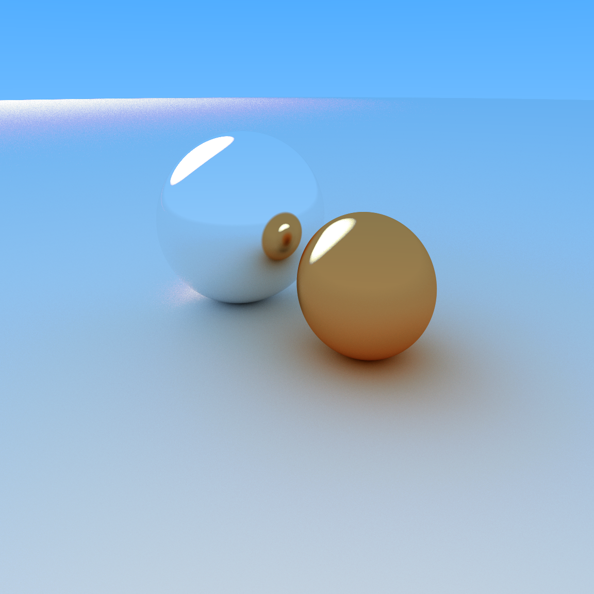
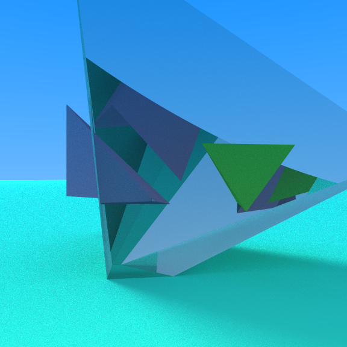
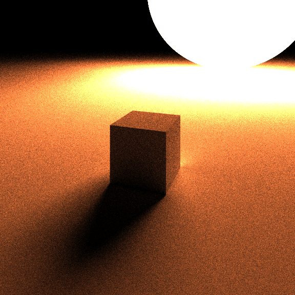
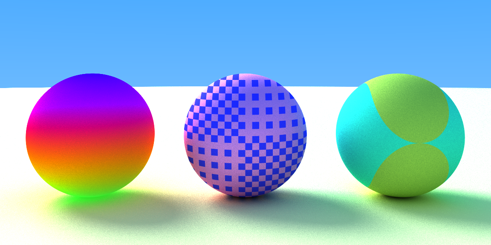

This code implements a basic raytracing computer graphics algorithm from scratch using Julia. The code is designed to run on an Nvidia GPU using the CUDA package, 
and creates images in the PNG format by default.

The program is capable of physically modelling and rendering metallic, matte, emissive and glass objects as well as textures. Realistic lighting is achieved with global 
illumination, reflecting and refracting light as well as scattering it diffusely.

The code can handle spheres and triangular meshes with simple bounding boxes, however more optimisation work would be needed to render large scenes.

Some examples of rendering with this code:

